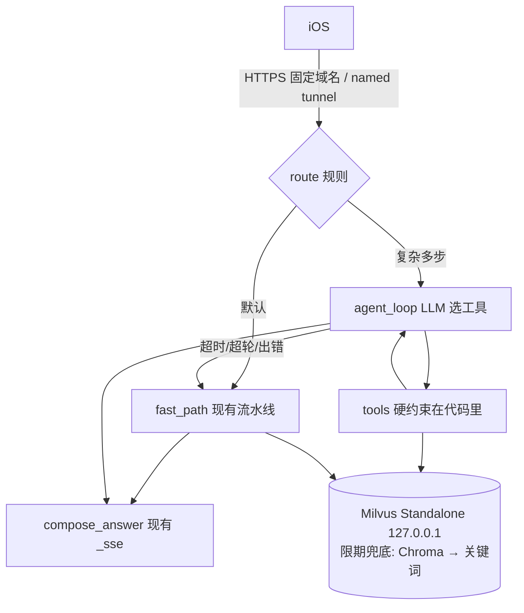

# PLAN.md：狮选 LionPick 工业化升级（智能体框架 + Milvus 上生产）

> 2026-10-05 修订版（含对抗评审意见）。标注说明：**[实跑]** 执行过，**[读码]** 读代码确认，**[文档]** 查了官方文档或 GitHub 页面，**[未验证]** 还没核实。
> 原则："代码写好了"不算完成，"在线上真实跑过并留下证据"才算完成。

---

## 0. 目标与叙事

**目标（按优先级）：**
1. **先把线上做成一个真正的"服务"**：固定域名、只暴露必要端口、用户数据有备份、外部探活能告警、CI 不过不部署。
2. **向量库从 Chroma 迁到 Milvus Standalone**：部署、迁移、回滚、监控、验证全部在线上完成并留证据。
3. **双路架构**：常见问题走现在的确定性快路，复杂多步问题走 **LangGraph** 智能体。硬约束写在工具代码里。

**面试叙事：**
- 原来有三处说不硬：
  - 文档叫它 "Agent"，实际是固定流水线；
  - Milvus 代码写了但没上线；
  - 线上是 quick tunnel 加单机裸跑，没有 SLO、备份和告警。
- 做完之后能讲的是一套可复用的方法：
  - 成熟框架加确定性护栏；
  - 存储迁移按"离线一致性 → 回放门槛 → 影子 → 切换 → 回滚演练"走；
  - 把"可用"定义成可度量的 SLO。
- **不变的东西：** iOS 的 SSE 协议不变，智能体阶段 iOS 不需要重新打包。

---

## 1. 现状与差距（只写事实）

### 1.1 现在是流水线，不是智能体
- 顺序写死 [读码]：正则识别意图 → 规则解析约束 → 同义词 → 混合召回（bge-small-zh 加 jieba BM25，RRF 融合）→ 否定词过滤 → 交叉编码器精排 → 相关性门槛 → 汇率复核 → 价格排序 → 👍/👎 先验 → LLM 写回答。
- `server/app/routes/chat.py` 共 1373 行，`_sse` 在第 65 行，`_stream_chat_with_retry` 在第 651 行 [读码]。
- README 第 10 行和第 19 行自称 "AI Agent" [读码]。

### 1.2 多跳：正则加固定两跳，有两个 bug
- 入口在 `chat.py:933-955`：`detect_multihop`（`rag/retrieve/multihop.py:169`）→ `multi_hop_retrieve`（`rag_client.py:926`）。出任何异常都静默退回单跳 [读码]。
- **Bug 1（会给出错误答案）：** `multihop.py:228-230` 的 `anchor_attrs` 拿不到 `price_cny` 时直接用外币的 `base_price`。这个值会传进 `_assert_relation`（`rag_client.py:1021`）和兜底排序 `_pv`。结果是外币锚点的"比它便宜"上限被算错 [读码]。**9/28 本地实跑复现**："比 AirPods Pro 便宜的降噪耳机"锚到了海外版 AirPods Pro 2（$249 被当成 ¥249），比它便宜的一件都没有，于是走放宽，推出来的 4 件（约 ¥2670 / ¥2878 / ¥1699 / ¥1899）全都比它贵 [实跑；单测待写]。
- **Bug 2（只损失召回）：** `rag_client.py:1002` 用 `intent_text=target_text` 调 `top_k`。`top_k` 的话题切换检测（722–831 行）可能判定为换话题，然后在 833–834 行把 hop2 的过滤条件置空。由于 1021 行还会再断言一次，后果是结果变少、退到 relaxed 兜底，**不会给出错误答案** [读码]。

### 1.3 LLM 通道接不住工具调用
- `llm_provider.py:72-84` 只读取 `delta.content`，`stream_chat` 没有 `tools` 参数 [读码]。
- `negation.py:87-171` 靠提示词让模型输出 JSON，再用 json.loads 解析，失败就静默降级 [读码]。
- 默认模型三处不一致 [读码]：
  - `llm_provider.py:167` 默认 sonnet-4-6；
  - `negation.py:120` 默认 haiku-4-5；
  - `.env.example` 写的是 sonnet。

### 1.4 向量库
- 已有能力 [读码]：
  - `rag/store/` 抽象层，`RAG_STORE=chroma|milvus`；
  - schema v2；
  - `migrate.py` 跨后端搬数据，不重算向量；
  - `store_parity.py` 做一致性比对；
  - 已锁定 `pymilvus==3.0.2`、`milvus-lite[chinese]==3.2.1`。
- `docs/VECTOR_STORE.md` 的压测在 M4 笔记本上用 Lite 跑：100 万条时 Chroma 21.7s / recall .760，Lite 1.0s / .985。**Standalone 从没测过。**
- 线上 [实跑，只读 SSH 34.73.32.90，2026-10-05]：
  - backend=chroma，text 1082 条、image 145 条，`schema_version` 为 null；
  - 没装 pymilvus，没装 Docker；
  - Python 3.10.12（Dockerfile 和 CI 是 3.11）；
  - Ubuntu 22.04.5。
- 资源 [实跑]：
  - 4 vCPU，内存 15990MB，**可用 13.5GB**，没有 swap，磁盘剩 39G；
  - uvicorn RSS 3.1GB，watt-demo 约 37MB；
  - `MemoryMax=infinity`，**单 worker**。

### 1.5 线上保护网的洞（P0 必须先补）
| 洞 | 证据 |
|---|---|
| **公网入口是 Cloudflare quick tunnel**（`cloudflared tunnel --url`），每次重启 URL 都会变，没有 SLA | [实跑] `systemctl cat lionpick-tunnel` |
| **uvicorn 监听在 0.0.0.0:8000**，GCP 防火墙情况不明 | [实跑] `ss -ltnp`；防火墙 [未验证] |
| **验证码随响应返回**：默认 `USER_STORE_BACKEND=local` 时，`/auth/phone/start` 和密码重置把 `dev_code` 放在响应里，知道手机号就能接管账号 | [读码] `user_store.py:249`、`:384`；VM 上是哪种模式 [未验证] |
| **越权（IDOR）**：preferences / price_watch / repurchase / group_buy 直接信任客户端传来的 `user_id`；`phone:<手机号>` 格式可以枚举 | [读码] 路由文件里没有 JWT 校验 |
| **全项目没有任何限流**：短信验证码可被暴力猜，`/chat/stream` 可被刷 LLM 费用 | [读码] server/app 里搜不到 slowapi / limiter |
| **JWT 密钥**：缺 `LIONPICK_JWT_SECRET` 时退回源码里的公开默认值 | [读码] `jwt_session.py`；VM 是否已设置 [未验证] |
| **SQLite 用户数据没有备份**：users.db / preferences.db / price_watch.db / repurchase.db / group_buy.db | [实跑] ls |
| `/ready` 发现不了向量库故障：`query.py:241` 的 `except` 会转成关键词兜底，预热照样通过 | [读码] |
| autodeploy 检查用的是 `curl -sf \| grep ready`，CI 不过也会部署（CI 只在 push 到 `Tujie` 分支时触发） | [读码] `cloud-autodeploy.sh:58`、`rag-eval.yml:18` |
| 没有 `/metrics`，没有外部探活，没有告警通道 | [读码] |
| 每次部署都会 restart 单进程，停服时长没量过 | [读码] |
| 遗留误导项：requirements 里有 `qdrant-client`，还有 qdrant 的 compose | [读码] |
| VM 上有 `server/.env.bak.1787523704`，内容没检查 | [实跑：看到文件，没打开] |
| 本地 `.venv` 里是 openai 2.54，锁定版本是 1.51 | [实跑] |

---

## 2. 架构

### 2.1 总图

用 LangGraph 实现：一个 `StateGraph`，四个节点。状态里存会话约束、候选商品 ID、工具调用轨迹。

### 2.2 路由规则（只用规则）
- **走智能体：** 依赖其他商品（比 X 便宜 / 同价位 / 同品牌 / 搭配）、对比两个以上商品、"N 元内配齐一套"、跨币种比较。
- **其余一律走快路。**
- 开关 `AGENT_PATH=off|shadow|on`，外加 `AGENT_MAX_CONCURRENCY`（信号量）。超过并发上限的请求直接走快路。

### 2.3 工具（普通函数加 pydantic schema，不依赖框架）
| 工具 | 代码里强制执行的约束 |
|---|---|
| `search_products(...)` | 会话约束从图状态里读。LLM 传的参数只能收紧、不能放宽 |
| `get_product(id)` | 只返回商品目录里真实存在的 ID |
| `price_of(id)` | 统一换算成 CNY（复用 Bug 1 修复后的同一个函数） |
| `compare(ids)` | 只对比本轮检索到的商品 |
| `extract_constraints(text)` | 强制工具调用，类目用 enum 限定，替换 negation 的 JSON 解析 |

**不做** add_to_cart 加 `interrupt()`：要改 iOS，而且已有购物车意图（`test_cart_intent.py`）。

### 2.4 护栏
- 最多 3 轮工具调用，外加 `recursion_limit`。智能体路径总时长上限 8 秒，超时就回退快路。
- 商品卡由服务端按 ID 回填，LLM 只能引用 ID。
- 前导文本只记进 trace，不推给前端。
- 工具全部只读，商品文本进模型时视作数据，防提示词注入。

### 2.5 SSE
- 现有事件原样保留，由 `compose_answer` 通过 `get_stream_writer()` 调用 `_sse()` 发出。
- 新增 `agent_step` 事件默认关闭。iOS 是否忽略未知事件 [未验证]，验证之后再开。

---

## 3. 选型

### 3.1 智能体框架：LangGraph 1.2.x，只当编排运行时用
**"市面上成熟的搭建格式"一览：**
- **编排：** LangGraph 图（代码定义）。
- **工具协议：** OpenAI function calling / JSON Schema。
- **互操作：** MCP，P4 之后可选。
- **仓库约定：** `AGENTS.md`。
- **不用**声明式 YAML Agent：ADK 的只支持 Gemini，Open Agent Spec 采用率低。

**选 LangGraph 的理由：**
1. **现有锁定下零升级就能装** [实跑，用假 LLM]：分流、工具内硬约束、custom 流式、检查点、interrupt 恢复都跑通了。
2. **成熟度：** 42,747★，PyPI 1.0.0 发布于 2025-10-17，最新 1.2.13 [文档，curl GitHub 页面和 PyPI JSON]。
3. **字节相关：**
   - DeerFlow 2.0 README 原文："Built on LangGraph and LangChain" [文档]；
   - Eino README 写它 "draws from LangChain, Google ADK" [文档]。
   - 只能说"概念对应"，**不能说字节内部生产在用**。
4. **说清楚依赖：** langgraph 1.2.13 依赖 `langchain-core≥1.4.7`（会带进 langsmith 和 httpx）[文档 PyPI]。准确说法是"不用 LangChain 的模型封装，也不用 `langchain-openai`"，生产环境显式设 `LANGSMITH_TRACING=false`。

**其他框架：**
- **备选：** Pydantic AI。代价是要一起升级 pydantic、openai、httpx、anthropic；实测 httpx 0.28 配旧版 SDK 会报 TypeError [实跑]。
- **兜底：** 约 150 行自己写的 tool-use 循环。工具层和评测都不用改。
- **不选的：**
  - OpenAI Agents SDK、Google ADK：要求升级 FastAPI/Starlette；
  - CrewAI：依赖重、和 chromadb 冲突、默认开遥测；
  - smolagents：靠模型写代码执行；
  - Claude Agent SDK：子进程跑 CLI；
  - Eino：只有 Go；
  - Dify / Coze：是平台不是库。Coze 的 compose 用 `milvus:v2.5.10` [文档]，可以作为字节自家平台用 Milvus 的旁证。

### 3.2 工具调用通道
- TokenRouter 加 haiku-4-5 走 OpenAI 兼容接口 [实跑，本地 key，3 次调用]：
  - 非流式 1.92 秒；
  - 流式首个工具片段 1.11 秒；
  - 回填工具结果后出最终回答 1.85 秒。
- **官方没有工具调用文档** → 需要启动时加每日自检，失败就把 `AGENT_PATH` 降为 off。
- 并发：余额 ≤$10 时 5 个并发 [文档，未复核]。智能体会把 LLM 调用放大 2–4 倍，所以要加信号量。
- 豆包：文档写明支持，但 key 返回 401，**没验证**。
- 代码改动：`llm_provider.py` 新增 `chat(messages, tools, tool_choice, stream)`，返回结构化事件；原来的 `stream_chat` 留给快路。

### 3.3 Milvus：Standalone 加 Docker Compose，部署在现有 VM
- **版本：** Milvus **v3.0.2**、pymilvus 3.0.2、milvus-backup 0.6.0 [文档 releases.atom]。
  - **风险：** 3.0.0 在 2026-07-29 才发布，3.0.2 是 2026-09-28 发的。
  - **选它的理由：** 开发、Lite、parity 全在 3.x 客户端上做；数据可以分钟级重建；能秒级回退 Chroma。
  - **退路：** v2.6.25（同日发布，成熟线），需要同时改钉 pymilvus 2.6.x 和 milvus-backup 0.5.x。
- 官方 v3.0.2 tag 下的 compose **镜像还写着 v3.0.1** [文档，raw 文件]，必须**显式钉 `milvusdb/milvus:v3.0.2`**（Docker Hub 上有，已核实）。
- **加固**（compose 拷进 `deploy/milvus/`，不用 override 拼接 ports）：
  - 所有端口绑 127.0.0.1（Docker 发布的端口会绕过 ufw）；
  - 改掉 MinIO 默认密码；
  - `restart: unless-stopped`；
  - 打开鉴权；
  - 每个容器设 `mem_limit`。
- **用 collection alias：** 业务只认 `products_text` 这个别名，实际集合是 `products_text_v2_<日期>`。重建索引就是建新集合、跑 parity、切别名。这是真正的工业用法。
- **资源：** 可用内存 13.5GB，1082 条规模下不紧张。SIMD 风险低，首次启动看日志确认 [未复核官方 prerequisite]。
- **不选：**
  - Lite 嵌入式：单进程独占，官方说不面向生产；
  - Zilliz 免费版：只在 us-west1，空闲 7 天会自动暂停；
  - Distributed：需要 k8s。

---

## 4. 分阶段计划（约 3 周，单人）[估计]

每个阶段合进 main 时线上默认行为不变，靠开关逐步打开。

### P0：安全与服务化止血（4 天）
| # | 改什么 | 验收证据 |
|---|---|---|
| 0.0 | **安全止血（排在最前）：** `dev_code` 只在 `DEMO_MODE=1` 时返回（演示机保留，生产关闭）；preferences / price_watch / repurchase / group_buy 统一从 JWT 取 `user_id`；`/auth/*` 和 `/chat/stream` 按 IP 和用户限流（slowapi）；VM 上确认已设 `LIONPICK_JWT_SECRET`；仿照 `test_delete_authz.py` 补 4 个越权测试 | 越权测试全绿；生产环境请求验证码，响应里没有 `dev_code`；压测超过阈值返回 429 |
| 0.1 | **固定入口：** quick tunnel 换成 named tunnel 加固定域名（需机主提供 Cloudflare 账号和域名，见 §7）。iOS 默认 URL 指向它 | 重启 tunnel 后域名不变，外部 curl 返回 200 |
| 0.2 | **收紧暴露面：** 先确认没有客户端直连 IP:8000，再把 uvicorn 改成 `--host 127.0.0.1`；查 GCP 防火墙 | VM 外 `curl IP:8000` 失败，通过域名正常 |
| 0.3 | **用户数据备份：** 每晚用 `sqlite3 .backup` 备份 5 个 db，压缩后传 GCS，保留 14 天；做一次恢复演练 | 恢复到临时目录后，行数和 checksum 一致 |
| 0.4 | **就绪门控：** 新增 `vector_store_gate()`，绕开兜底直接查向量库，要求结果非空、条数达标；Milvus 模式下还要求 schema v2、索引已建完。失败返回 **503**，用单测钉住状态码 | 非生产端口加错误 URI 时返回 503；生产仍是 200 |
| 0.5 | **观测和告警：** `/metrics` 只绑本机（fallback 计数、各阶段延迟、首字时间）；**外部探活**用 GCP Uptime Check 打固定域名的 `/ready`，告警发邮件或飞书 | 故意停服触发一次告警，截图存档 |
| 0.6 | **CI 守住部署：** rag-eval 改成 main 的 PR 和 push 都触发，开 branch protection；autodeploy 只部署 CI 全绿的 SHA（私有仓库查 status API 要 token [未验证]） | 一次 PR 跑绿的链接；红的 SHA 不会被部署（日志） |
| 0.7 | **配置进 git：** `deploy/prod.env`（不含机密）加 systemd drop-in；机密放 `/etc/lionpick/*.secret.env`，权限 600 | 改一个开关等于一次提交，回滚时配置一起退回 |
| 0.8 | **修 Bug 1：** `anchor_attrs` 和 `_pv` 统一走汇率换算；补外币锚点单测。同时写一个复现 Bug 2 的单测 | 单测加多跳评测 34/34 |
| 0.9 | **清理：** 删 qdrant；统一默认模型，在 `/ready` 暴露当前生效的模型；依赖改用锁文件，Python 统一 3.10 或升级 VM，CI 和 VM 同版本；修正 CLAUDE.md 里的 IP；检查并处理 `.env.bak`（需机主确认） | CI 绿 |
| 0.10 | **量化停机时间：** 测一次 restart 到 `/ready` 200 的时长，写进 SLO 文档 | 实测秒数 |

**SLO（初版，按实测校准）：**
- 外部探测可用性 ≥99.5%/月；
- 快路首字 p95 ≤3s；
- 5xx 比例 ≤1%；
- 计划内重启单次停服 ≤N 秒。

**容量：** 用 `tools/stress_e2e.py` 测单 worker 能扛的 QPS 拐点，写进文档。

**回滚：** `git revert`，autodeploy 自动生效。

### P1：Milvus 上生产（1–1.5 周）
**代码：**
- `ShadowStore`：影子查询在后台线程跑，超时就丢弃，结果写 JSONL；
- `RAG_MILVUS_DB` / `RAG_MILVUS_CONSISTENCY`：一致性级别可配，1082 条且没有流式写入时差别可以忽略，不当卖点；
- 别名支持；
- `RAG_STORE_FALLBACK=chroma`：**限期 14 天**，到期删掉，避免两边长期不同步；
- `scale.py` 加 `--milvus-uri` 的同时，硬性拒绝对生产库执行 reset（今天它总是自己拉起 Lite，加参数之后才有风险）；
- `requirements-milvus.txt` 拆开，生产只装 pymilvus。

**步骤：**
1. **资源准备（需 sudo，见 §7）：** 装 Docker；数据卷放 `/srv/milvus`；按加固版 compose 起服务，看 SIMD 日志；改 root 密码，建 `lionpick_app`（只读）和 `lionpick_admin` 两个用户；`pip install --dry-run pymilvus==3.0.2` 看依赖后再装。
2. **离线一致性：** 重建 v2 索引并导出 npz → migrate → `store_parity` exit 0 → 两个后端上 `rag.eval.run` 输出逐字相同 → 多跳评测 34/34。线上 Chroma 一个字节都不动。
3. **回放门槛：** golden 加 compositional 共 153 条，再加 stress_e2e 回放，至少 1000 次查询：
   - 错误 0；
   - top-10 一致率 ≥99%，不一致的都能用 numpy 精确解解释；
   - p95 ≤50ms（按实测校准）。
4. **线上影子 48 小时**（真实流量少，不硬凑 7 天）。
5. **故障演练：** `docker stop` 停掉 Milvus，告警触发、用户路径降到 Chroma；start 之后自动恢复。**整机 reboot 演练：** docker、milvus、lionpick 按顺序自动起来（lionpick 的 unit 加 `After=docker.service`，就绪门控会等 Milvus healthy）。
6. **切换：** 先存档 `/ready` 和延迟基线，提交 `RAG_STORE=milvus` 加反向影子；48 小时后再单独提交打开过滤下推。一次只改一个变量。
7. **监控：** 一个 Prometheus 容器（绑 127.0.0.1）抓 Milvus `:9091` 和应用 `/metrics`。告警规则：
   - healthz 连续 2 分钟失败；
   - 容器重启；
   - fallback 计数增加；
   - p95 超阈值；
   - 磁盘超 80%；
   - Milvus 内存超 mem_limit 的 80%。
   
   告警走 P0.5 的同一个通道。Attu 不常驻，需要时通过 ssh 隧道临时开。
8. **备份（向量是派生数据）：** 主恢复路径是 npz 加 sha256 → `rag.store.load` 分钟级重建。milvus-backup **演示一次**备份和恢复到 `restore_drill` 库，再跑 parity，不设每晚任务。
9. **大规模压测不在生产机上做：** 开一台临时 spot VM（同机型）跑 10 万 / 100 万条的 Lite vs Standalone 对比，跑完销毁（花钱，见 §7）。不做的话就沿用 M4 的数据并注明出处。

**验收证据：**
- `/ready` 显示 backend=milvus、mode=server、schema v2、1082/145、别名指向的具体集合；
- 回放和影子报告；
- 故障演练和 reboot 演练日志；
- 恢复演练的 parity 输出；
- VM 上的延迟对比，照实写：1082 条时可能比进程内的 Chroma 还略慢。

**回滚：**
- L1：门控失败 → autodeploy 退回上一个 SHA，配置一起退回；
- L2：`git revert` 切换提交，`data/.chroma` 至少保留 14 天；
- L3：运行时降级到 Chroma（限期 14 天）。

### P2：评测先行，再上智能体路（1 周）
1. **先定评测（原 P3 前移）：** 轨迹用例（期望的工具序列、约束满足率、两跳正确性、外币锚点）。对比指标：正确率、pass^k、首字和总延迟 p50/p95、每请求的 LLM 调用次数和 token 数。自己实现，不依赖 agentevals。
2. **VM 上用生产 key 跑工具调用自检**（非流式、流式、回填三项）。生产 key 和模型是否和本地一致 [未验证]。
3. **工具化加单测：** 传宽的参数会被压回去；外币锚点价格正确。
4. **搭图：** `langgraph==1.2.13` 锁定版本，`LANGSMITH_TRACING=false`。`_stream_chat_with_retry` 的重试规则按事件类型重新定义。
5. **`AGENT_PATH=shadow`：** 只记 trace。达标标准写在评测文档里：智能体在复杂类问题上正确率 ≥ 快路，且 p95 ≤8 秒，然后切到 `on`。

**验收：**
- VM 自检输出；
- 智能体路径多跳评测 ≥34/34；
- shadow trace 样例；
- 线上"比 XX 便宜的耳机"的 SSE 原始输出；
- 现有 IPA 不更新也能正常显示。

**回滚：** `AGENT_PATH=off`（一次提交）；出错时本来就会回退快路。

### P3：线上对比与观测（3 天）
- 每个请求记录各阶段耗时，默认写本地 JSONL 再用脚本汇总；Langfuse Cloud 可选（见 §7）。
- 输出一张快路 vs 智能体路的对比表，数据来自线上实跑。智能体在哪类问题上不如快路就照实写，并收紧路由。

### P4：文档与证据包（2 天）
- README、ARCHITECTURE 改成"确定性快路 + LangGraph 智能体路"。
- 新增 `docs/AGENT.md`、`docs/RUNBOOK.md`（部署、备份恢复、回滚、告警处理、reboot）、`docs/SLO.md`、`AGENTS.md`。
- 证据包：上面各阶段的输出和截图。

---

## 5. 风险与对策
| 风险 | 对策 |
|---|---|
| Milvus 3.0.x 太新，有未知 bug | 钉 v3.0.2 镜像；parity 门槛；退路 2.6.25；Chroma 兜底 14 天 |
| 照抄 compose 装成 3.0.1，或端口暴露到 0.0.0.0 | 仓库内维护加固版 compose；部署后跑 `ss -ltnp` 检查 |
| 切换时重启停服 | P0.10 量化；放在低峰时段；SLO 里写明计划内停机 |
| TokenRouter 工具调用没有文档、并发低 | 每日自检加自动降级；信号量；豆包备用（需新 key） |
| 智能体多 4–6 秒 | 只有命中规则才走；8 秒上限后回退 |
| 门控太严导致误回滚 | 先在非生产端口验证；保留 150 秒窗口 |
| 1082 条时 Milvus 更慢 | 照实说；迁移价值在扩展性和运维闭环 |
| 依赖漂移 | 锁文件；CI 和 VM 同一个 Python 版本 |
| quick tunnel 的 URL 变了 iOS 就连不上 | P0.1 换 named tunnel |
| 单机单点（VM 宕机时整个服务不可用） | 外部探活加告警；runbook 写重建步骤；承认是单机，不吹高可用 |

---

## 6. 面试怎么讲 / 不能说的话

**可以讲：**
- "先把它做成一个服务：固定域名、最小暴露面、用户数据每晚备份并做过恢复演练、外部探活告警、CI 不过不部署。"
- "原来的就绪检查有个洞：向量库挂了也报健康，自动回滚等于没有。我先补这个洞，再做迁移。"
- "向量是派生数据，主恢复路径是重建；真正要备份的是用户库。"
- "迁移流程是离线 parity（以精确解为准）→ 回放门槛 → 影子 → 一次只改一个变量 → 三层回滚 → 故障和 reboot 演练。重建索引用 alias 切换。"
- "选 3.0.2 是因为开发和测试链路都是 3.x，而且数据能分钟级重建、能秒级回退。我知道它很新，所以准备了 2.6.25 这条退路。"
- "智能体只接复杂请求。硬约束在工具里，商品卡由服务端回填。选 LangGraph 是为了状态、检查点和流式；它依赖 langchain-core，但我没用 LangChain 的模型封装。"

**不能说：**
- ❌ "零停机"：单实例，切换就要重启。
- ❌ "迁 Milvus 是为了降延迟"。
- ❌ "在生产上持续压测"或"生产挂大目录"。
- ❌ "字节内部用 LangGraph / Eino 做生产"。
- ❌ "多智能体"、"支持 MCP/A2A"（除非真做了）。
- ❌ "豆包工具调用实测过"。
- ❌ "高可用"：这是单机。
- ❌ 任何不能指向存档输出的数字。

---

## 7. 需要机主决定
| # | 事项 | 原因 |
|---|---|---|
| 1 | Cloudflare named tunnel 加域名 | 要账号或域名，可能有费用 |
| 2 | VM 上装 Docker、起 Milvus、改 systemd、改 uvicorn 监听地址 | 需要 sudo，会改线上配置 |
| 3 | 用户 SQLite 每晚备份到 GCS | 少量费用；用户数据会离开 VM |
| 4 | 检查并处理 `server/.env.bak.1787523704` | 可能含真实 key，删除不可恢复 |
| 5 | GCP 防火墙核查和收紧，Uptime Check 加告警通道（邮箱或飞书） | 安全配置，gcloud 要重新登录 |
| 6 | 临时 spot VM 做大规模压测，还是只沿用 M4 数据 | 花钱 |
| 7 | 给 autodeploy 配查 CI 状态用的只读 token | 新增一个机密 |
| 8 | Langfuse Cloud 还是只写本地 JSONL | trace 会出 VM |
| 9 | TokenRouter 充值、豆包 key 重新申请 | 花钱或要账号操作 |
| 10 | 改 iOS 默认后端 URL 后重新打包 | 要走一遍 IPA 构建和分发 |
| 11 | 生产关掉 `dev_code` 后，演示时的手机号登录怎么办 | 没有真实短信网关；建议演示机开 `DEMO_MODE=1`，生产关闭 |

---

## 8. 验证证据栏
| 项目 | 状态 | 证据 |
|---|---|---|
| LangGraph 在现有锁定下运行 | ✅ 实跑（假 LLM） | scratchpad `lg_smoke.py` |
| LangGraph / AGENTS.md / DeerFlow / Eino / Coze 引用 | ✅ 文档（2026-10-05 curl GitHub 页面、releases.atom、PyPI） | 本文 §3 |
| Milvus 3.0.2 / pymilvus 3.0.2 / backup 0.6.0 存在；compose 钉的是 v3.0.1 | ✅ 文档 | releases.atom、raw compose、Docker Hub |
| TokenRouter 工具调用 | ✅ 实跑（本地 key） | `tr_tool_test.py` |
| 豆包工具调用 | ❌ 401 | — |
| VM 体检（内存、监听地址、quick tunnel、SQLite） | ✅ 实跑（只读） | 2026-10-05 SSH 输出 |
| Bug 1 / Bug 2 机理 | ✅ 读码，复现单测 ⬜ | rag_client.py:1002/1021/833 |
| 安全洞（dev_code、IDOR、无限流） | ✅ 读码（10-05） | user_store.py:249/384；routes/*；grep 无 limiter |
| 多跳示例跑出错误结果 | ✅ 实跑（09-28，本地） | 锚点 $249 被当 ¥249，放宽后结果全更贵 |
| P0.0 安全止血 | ✅ 线上（10-07） | DEMO_MODE=0（验证码接口 503，响应里没有 dev_code）；越权校验 report 模式（违规计数可见）；进程内限流；docs/SECURITY.md |
| P0.2 只监听本机 | ✅ 线上（10-07） | ss 只见 127.0.0.1:8000；外网直连不通；隧道 URL 不变，/health /ready 200 |
| P0.3 用户库备份 | ✅ 线上（10-07） | lionpick-backup.timer 每日；首份备份 integrity ok；restore_drill --strict ok |
| P0.6 CI 门禁 | ✅ 线上（10-07） | GitHub Actions pytest py3.10/3.11 + 检索评测门禁；autodeploy 只部署 CI 全绿的 SHA（已实测 CI pending → green → deploy） |
| P0.7 配置进 git | ✅ 线上（10-07） | deploy/systemd/lionpick.service.d/*，autodeploy 同步 drop-in + daemon-reload |
| P0.1 固定域名 / P0.5 外部探活告警 | ⬜ 机主决定暂缓 | quick tunnel 仍在；整机 reboot 演练同样暂缓 |
| 多模态：拍照 + 文字条件生效 | ✅ 线上（10-07） | VM 实测：不要耐克的 → 无耐克；有没有便宜点的 → 全部更便宜；全程不调 LLM |
| 做法 A：离线图片描述 + SKU 规格入索引 | ✅ 线上（10-07） | 本地 Qwen3-VL-2B 生成 145/145；索引 1327 条；parity 0 条更差；回放门槛 PASS；compositional 0.821→0.830 |
| Milvus 上线、演练 | ✅ 线上实跑（10-07） | 线上 RAG_STORE=milvus（Standalone v3.0.2）；回放门槛 1410 次 PASS；故障演练 503 → 兜底 → 自动恢复；npz 重建 + 别名回滚；见 docs/RUNBOOK_MILVUS.md「线上实跑记录」。**未做：reboot 演练（quick tunnel 会换 URL）、监控告警** |
| 智能体路 | ✅ 实现 + 线上评测（10-07），**按数据决定不开** | 快路 31/34 vs 智能体 21/34（pass^2，修复后）；见 docs/AGENT.md §12.1 |

## 9. 进度日志
- 2026-10-07（夜）：**P0 主体 + 多模态 + 做法 A 上线**。安全止血（DEMO_MODE=0、越权 report、限流、默认密钥保护）、uvicorn 只听 127.0.0.1（隧道不变）、SQLite 每日备份 + 恢复演练、CI（pytest + 检索门禁）+ autodeploy 只部署 CI 全绿 SHA、systemd drop-in 进 git；拍照找货改为"视觉召回 → 文字硬约束 → 文字排序 → 约束清空时同品类文字检索"，召回改全量排名再掩码；本地 Qwen3-VL-2B 给 145 张图写外观描述（图中文字因幻觉不进索引）+ SKU 规格块入索引。第一版规格块里 45 个完全相同的"规格:标准"让 Milvus HNSW 结果残缺，被 store_parity 拦下、别名秒级回滚；修复后重建（1327 条），parity 0 条更差、回放门槛 1410 次 PASS。全程未调用付费 LLM。未做：固定域名、外部探活告警、reboot 演练、越权切 enforce（需新版 iOS 上机）。
- 2026-10-07：**P2 复测**。修复后智能体 pass^2 21/34（多跳 9/13、美元锚点 5/6、对比 4/7、跨币种 3/3、配套 0/5），p50/p95 5.3/8.0 s；快路 31/34（多跳 13/13、美元锚点 6/6、对比 7/7、跨币种 3/3、配套 2/5）。快路每一类都不输，线上保持 AGENT_PATH=off。下一步若要继续：配套类做并行检索/专用工具，规划换更快的模型。
- 2026-10-07：**P1 上线**。VM 装 Docker 29.1.3，起 Milvus Standalone v3.0.2（首次启动因数据目录属主报 FATAL，chown 999 后正常）；bootstrap 账号，app 只读权限经实测；旁建 v2 Chroma + npz（119 s），迁移进版本化集合 + 别名（7 s）；store_parity 通过；回放门槛 1410 次、错误 0、PASS（Milvus p50/p95 11.5/34 ms，Chroma 17.8/70.9 ms）；正向影子 15 次 0 错误；**影子只跑了几分钟，没等 48 小时**，改用切换后反向影子 + 14 天兜底；切换 RAG_STORE=milvus，门控 enforce；故障演练与 npz 重建 + 别名回滚通过。每次重启到 /ready 200 实测 21–40 s。发现：线上 golden recall@5 是 0.924（.env 里 RERANK_INPUT_CAP=10、RERANK_MAX_LENGTH=128），本机默认参数是 0.947。
- 2026-10-07：**P2 实现并评测，未上线**。LangGraph 智能体路径 + 多跳两个 bug 修复已部署（AGENT_PATH 默认 off）；多跳修复默认生效。VM 生产 key 工具调用自检通过（1.75 s / 1.05 s）。首轮真模型评测：快路 pass^1 31/34，智能体 pass^2 15/34，失败主要是 8 s 预算超时（每次带工具的 LLM 调用约 3 s）和"对比完不调 submit_products"导致 no_citable_products；后者已修（兜底引用 + 对比类 compare 后直接收尾），复测见下一条。预算配套（bundle）类 20 s 也超时，属于设计问题，需要并行检索或专用工具。
- 2026-10-05：补入 P0.0 安全止血（来自同日工业级对标评审：验证码随响应返回、越权、无限流），以及附录 A 框架与格式对比。
- 2026-10-05：完成调研和对抗评审，修订本计划：新增 quick tunnel、监听地址、SQLite 备份、CI 门控等发现，删掉在生产机上压测等过度设计。仓库和 VM 均未改动（SSH 只做了只读检查）。

---

## 附录 A：市面上成熟的智能体框架与"搭建格式"（2026-10-05 核实）

### A.1 框架

| 框架 | Stars | 最新版 | 稳定版时间 | 在我们现有依赖锁定下 | 结论 |
|---|---|---|---|---|---|
| **LangGraph** | 42.7k | 1.2.13 | 1.0 于 2025-10-17 | **零升级可装**，已用假 LLM 跑通分流、工具硬约束、流式、检查点、中断恢复 | **主选**（只当编排运行时） |
| Pydantic AI | 20.4k | 2.54.0 | v2 于 2026-06-23 | 要一起升级 pydantic / openai / httpx / anthropic | 备选 |
| OpenAI Agents SDK | 29.8k | 0.23.1 | 仍是 0.x | 要升级 FastAPI / Starlette | 不选 |
| Google ADK | 21.7k | 2.11.0 | 1.0 于 2025-05；2.0 于 2026-05 | 要 fastapi≥0.133；YAML 配置只支持 Gemini | 不选 |
| Microsoft Agent Framework | 14.0k | 1.20.0 | GA 于 2026-04-02 | core 能装，OpenAI 适配要升 openai | 不选（偏 Azure） |
| Claude Agent SDK | 8.2k | 0.2.x | 仍是 0.x | 子进程跑 CLI，适合编码类智能体 | 不选 |
| CrewAI | 59.4k | 1.15.x | 1.0 于 2025-10 | 和 chromadb 冲突，依赖约 85 个，默认开遥测 | 不选 |
| Agno | 42.6k | 3.1.1 | 3.0 于 2026-08 | 自带 API 服务层，和我们的 FastAPI 重叠 | 不选 |
| smolagents | 29.7k | 1.26.0 | — | 靠模型写代码执行，近 90 天没发版 | 不选 |
| 字节 Eino | 13.2k | v0.9.x | 仍是 0.x | 只有 Go | 概念对照（Coze 的运行时引擎） |
| Coze Studio / Dify | 21.7k / 157.9k | — | — | 低代码平台，不是库 | 不选；Coze 默认用 Milvus，可作旁证 |

一句话：**ReAct 循环本身不值得为它引一个框架，框架的价值在状态、检查点、人工确认、追踪和流式。**工具层写成和框架无关的普通函数加 pydantic schema，这样随时能在 LangGraph 和约 150 行的自写循环之间切换。

### A.2 "搭建格式"与标准

| 名称 | 是什么 | 对狮选 |
|---|---|---|
| **MCP** | 工具协议，已捐给 Linux 基金会下的 Agentic AI Foundation；Python SDK 2.x 要求 pydantic≥2.12 | 可选：把目录搜索做成只读 MCP 服务，等 pydantic 升级后再做 |
| **A2A** | 智能体之间的协议，用 Agent Card 做发现 | 单智能体用不上 |
| **AGENTS.md** | 给编码智能体看的仓库说明（24.8k★） | 低成本：照 CLAUDE.md 加一份 |
| **Agent Skills（SKILL.md）** | 一个文件夹 = SKILL.md + 脚本和参考资料，按需加载 | 偏开发流程，导购运行时用不上 |
| **声明式配置**（ADK YAML、MAF YAML、Oracle Open Agent Spec） | 用 YAML/JSON 定义智能体 | **不用**：采用率低或只支持特定模型；智能体写在代码里，提示词和工具 schema 单独存文件做版本管理 |
| **plan.md / todo.md** | Manus 反复重写 todo.md 让目标留在注意力里；planning-with-files 的三个文件；GitHub spec-kit 的 specify → plan → tasks；Claude Code 的 plan mode | 本文件就按这个思路写：分节 + 验证证据栏 + 进度日志 |
