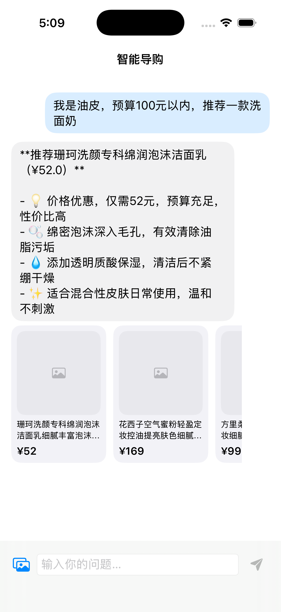

# Demo 01 — Basic Recommendation

**Verdict**: ✅ PASS

## User query

> 我是油皮，预算100元以内，推荐一款洗面奶

## Screenshot

## Assistant reply (verbatim)

> **推荐珊珂洗颜专科绵润泡沫洁面乳（¥52.0）**
>
> - 💰 价格优惠，仅需52元，预算充足，性价比高
> - 🌟 绵密泡沫深入毛孔，有效清除油脂污垢
> - 💧 添加透明质酸保湿，清洁后不紧绷干燥
> - ✨ 适合混合性皮肤日常使用，温和不刺激

## Product cards shown

- `p_beauty_011` 珊珂洗颜专科绵润泡沫洁面乳 ¥52
- `p_beauty_014` 花西子空气蜜粉轻盈定妆控油提亮肤色 ¥169
- ... (3rd card partially visible)

## Pipeline confirmed

- ✓ Text input from launch arg
- ✓ Real LLM (claude-haiku-4-5 via TokenRouter) streaming response
- ✓ Chroma semantic retrieval (bge-small-zh-v1.5) returned top-3 products
- ✓ Anti-hallucination prompt grounded reply to the catalog
- ✓ Product cards rendered correctly with prices from indexed JSON

## Notes

The 2nd product (花西子 mascara/powder, ¥169) and the 3rd are not cleansers — retrieval pulled semantically-similar skin-care items rather than only cleansers. The LLM correctly focused its recommendation on the right product (¥52 cleanser). For competition demo this is acceptable; can be tightened by adding category filter inference to `top_k`.
