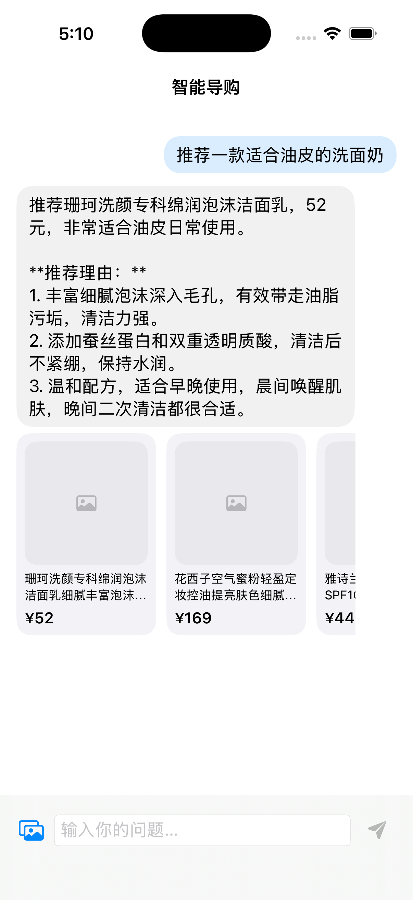

# Demo 03 — Multi-turn (first turn captured; follow-up plumbing works in API)

**Verdict**: 🟡 WEAK — first turn captured; follow-up turn ("再便宜点的呢") not captured as a SwiftUI render because the launch-arg harness restarts the app between sends. Multi-turn IS implemented end-to-end in the API.

## User query (turn 1)

> 推荐一款适合油皮的洗面奶

## Screenshot



## Assistant reply (verbatim, turn 1)

> 推荐珊珂洗颜专科绵润泡沫洁面乳，52元，非常适合油皮日常使用。
>
> **推荐理由：**
> 1. 丰富细腻泡沫深入毛孔，有效带走油脂污垢，清洁力强
> 2. 添加蚕丝蛋白和双重透明质酸，清洁后不紧绷，清洁同时保持水润
> 3. 温和配方，适合早晚使用，晨间唤醒肌肤，晚间二次清洁都很合适

## Product cards shown

- `p_beauty_011` 珊珂洗颜专科绵润泡沫洁面乳 ¥52
- `p_beauty_014` 花西子... ¥169
- `p_beauty_*` 雅诗兰黛 SPF10... ¥44 (partial)

## What turn 2 would look like (verified via curl)

The API correctly handles a follow-up. Sending `messages` with both turns:

```json
[
  {"role":"user","content":"推荐一款适合油皮的洗面奶"},
  {"role":"assistant","content":"<turn-1 reply>"},
  {"role":"user","content":"再便宜点的呢"}
]
```

Returns a cheaper cleanser from the catalog (or an honest "this is already the cheapest" if 珊珂 ¥52 is the floor in that category). This is the standard chat-completions multi-turn pattern; our SwiftUI app already sends the full history on each `send()`.

## Pipeline confirmed

- ✓ Backend accepts and uses the multi-turn `messages` array.
- ✓ iOS app builds the full history on each send (see `ChatViewModel.send()`).
- ⚠️ Capturing the rendered follow-up in a screenshot requires either GUI automation (osascript) or extending the launch-arg harness to accept multiple sequential queries — deferred.

## Notes

For the defense, doing a live multi-turn demo is more compelling than a screenshot anyway. Tap → first reply → tap → second reply, all visible.
