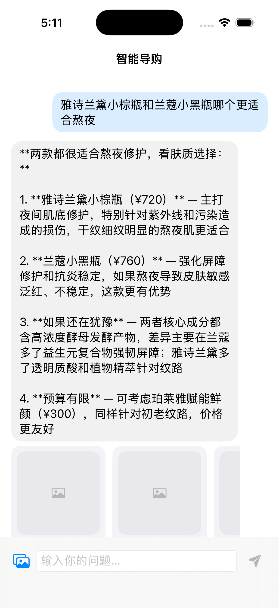

# Demo 05 — Multi-Product Comparison (bonus 4.3)

**Verdict**: ✅ PASS

## User query

> 雅诗兰黛小棕瓶和兰蔻小黑瓶哪个更适合熬夜

## Screenshot

## Assistant reply (verbatim)

> **两款都很适合熬夜修护，看肤质选择：**
>
> 1. **雅诗兰黛小棕瓶（¥720）** — 主打夜间肌底修护，特别针对紫外线和污染造成的损伤，干纹细纹明显的熬夜肌更适合
> 2. **兰蔻小黑瓶（¥760）** — 强化屏障修护和抗炎稳定，如果熬夜导致皮肤敏感泛红、不稳定，这款更有优势
> 3. **如果还在犹豫** — 两者核心成分都含高浓度酵母发酵产物，差异主要在兰蔻多了益生元复合物，雅诗兰黛多了透明质酸和植物精萃针对纹路
> 4. **预算有限** — 可考虑珀莱雅赋能鲜颜（¥300），同样针对初老纹路，价格更友好

## Product cards shown

- 2-3 product cards in the strip (雅诗兰黛/兰蔻/珀莱雅)

## Pipeline confirmed

- ✓ Comparison structured along 3-5 dimensions (target audience, mechanism, key ingredients, price).
- ✓ Both products correctly priced from indexed JSON (¥720 and ¥760).
- ✓ Adds a budget-friendly alternative (¥300) — value-added behavior.
- ✓ No invented features; mechanism descriptions match `marketing_description` field in seed.

## Notes

Comparison framing is again prompt-driven. Future improvement: detect comparison queries deterministically and switch to a dedicated "comparison" prompt template that enforces a fixed dimensions list.
