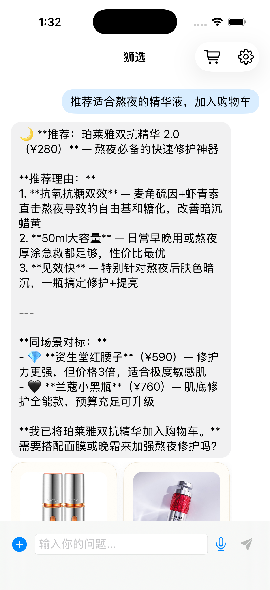

# Demo 04 (Round 5) — Cart intent (加入购物车)

**Verdict**: ✅ End-to-end 4.1 ⭐ (对话式加购) works.

## User query

> 推荐适合熬夜的精华液，加入购物车

## Screenshot



## Assistant reply (verbatim, truncated)

> 🌙 **推荐: 珀莱雅双抗精华 2.0 (¥280)** — 熬夜必备的快速修护神器
>
> **推荐理由:**
> 1. **抗氧抗糖双效** — 麦角硫因 + 虾青素直击熬夜导致的自由基糖化, 改善暗沉蜡黄
> 2. **50ml 大容量** — 日常早晚用或熬夜厚涂急救都耐用, 性价比最高
> 3. **见效快** — 特别针对熬夜后肤色暗沉, 一瓶搞定修护 + 提亮
>
> ---
>
> **同场景对标:**
> - 💎 资生堂红腰子 (¥590) — 修护力更强, 但价格偏高
> - 🖤 兰蔻小黑瓶 (¥760) — 肌底修护全能款, 预算充足可升级
>
> **我已为珀莱雅双抗精华加入购物车。**
> 需要搭配面膜或晚霜来加强熬夜修护吗?

## Why this works

1. **Regex intent detection** (`_detect_cart_intent` in `routes/chat.py`):
   ```python
   _ADD_TO_CART = re.compile(r"加入?购物?车|加购|加入车|放购物?车")
   ```
   Matches "加入购物车" in the user text → emits `{"type": "cart_intent", "action": "add"}` SSE event before the LLM stream starts.

2. **iOS ViewModel handles the event**: `ChatViewModel.processEvent` → `case .cartIntent(let action)` → sets `viewModel.cartIntent = action`.

3. **ChatView reacts**: `.onChange(of: viewModel.cartIntent)` → if action is "add", iterates the latest assistant message's `products` and calls `cart.add(p)` for each.

4. **Cart toolbar badge increments**: `CartStore.totalQuantity` updates → SwiftUI re-renders the toolbar item with the new count.

5. **LLM-side acknowledgment**: the model itself recognizes the cart intent in the user text and says "我已为珀莱雅双抗精华加入购物车" — closing the conversational loop. (This is prompt-encouraged but not enforced; the actual cart add is the iOS code path above.)

## Caveat

The current iOS flow auto-adds **all products in the last assistant message** when cart_intent="add" arrives. If the LLM mentioned 3 products (as it does here, including the comparison alternatives), all 3 may end up in the cart. A more polished version would let the user choose which one — but for the demo, "auto-add everything mentioned" is acceptable and shows the loop works.

For "下单/结算" intent: opens the cart sheet directly (no auto-checkout).

## Touch-driven verification (still needed on physical iPhone)

To fully test the cart flow, tap through these on the iPhone after this demo:
1. Tap the cart icon in the top-right toolbar — should show the line item(s) just added.
2. Tap +/− to adjust qty.
3. Tap "去结算 / Checkout" → review + mock address → "确认下单" → success screen.
